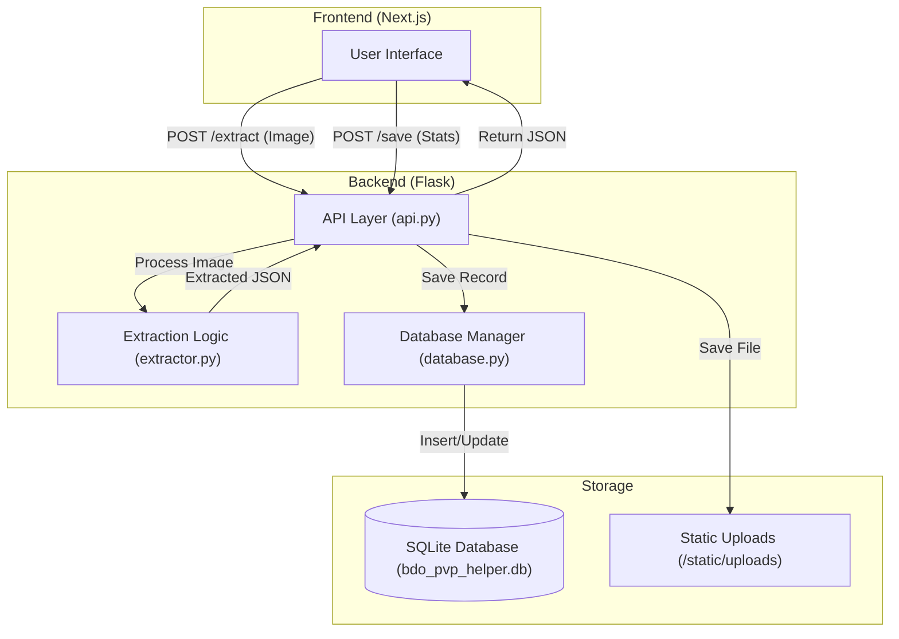

# Backend Architecture - BDO PvP Helper

The backend is built using **Python** and **Flask**, providing a robust REST API for scoreboard extraction, data persistence, and administrative management.

## System Overview

The backend is structured into three primary layers:

1.  **API Layer (`api.py`)**: The entry point for all frontend requests. It handles routing, authentication, and orchestrates the flow between the extraction logic and the database.
2.  **Processing Layer (`extractor.py`)**: Handles the core OCR logic. It processes uploaded images to extract text-based statistics from Black Desert Online Arena of Solare (AoS) scoreboards.
3.  **Data Layer (`database.py`)**: Manages the SQLite database, handling all CRUD operations for users, match results, and administrative workflows.

---

## Component Diagram

---

## Key Modules

### 1. API Layer (`api.py`)
*   **Framework**: Flask with Flask-CORS.
*   **Responsibilities**: 
    *   Serving extracted data to the frontend.
    *   User authentication (JWT-like sessions via NextAuth interaction).
    *   Administrative moderation endpoints (Approve/Deny).
    *   Serving static files (uploaded screenshots).

### 2. Extraction Logic (`extractor.py`)
*   **Engine**: EasyOCR (configured for BDO scoreboard resolution).
*   **Workflow**:
    1.  Image preprocessing (grayscale/thresholding).
    2.  Text region detection.
    3.  Character recognition for player names, kills, deaths, damage, etc.
    4.  Data normalization into standard JSON format.

### 3. Database Management (`database.py`)
*   **Engine**: SQLite.
*   **Schema**:
    *   `users`: Stores credentials, family names, and admin status.
    *   `scoreboards`: Stores match metadata, JSON extraction data, and approval status (`is_approved`).
    *   `bookmarks`: Stores user-saved class guides.
*   **Security**: Implements an administrative gate where matches from non-admin users must be approved before appearing in global stats.

---

## Data Flow: Match Submission

1.  **Upload**: User sends a screenshot to `/extract`.
2.  **OCR**: Backend extracts stats and saves the image to `/static/uploads`.
3.  **Preview**: Frontend displays extracted data for user verification.
4.  **Save**: User submits verified data to `/save`.
    *   If **Admin**: `is_approved` is set to `1` (Immediate).
    *   If **User**: `is_approved` is set to `0` (Pending).
5.  **Moderation**: Admin reviews pending records in the dashboard and updates status to `1` or deletes the record.
