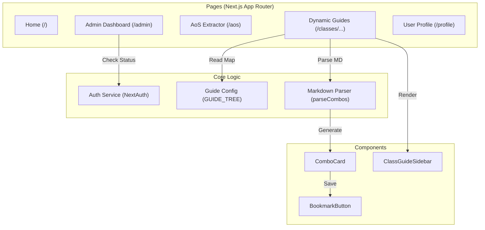

# Frontend Architecture - BDO PvP Helper

The frontend is a modern **Next.js** application using the **App Router** architecture, styled with **Vanilla CSS** for high performance and custom aesthetics.

## System Overview

The frontend is designed around a modular component architecture with a focus on dynamic content delivery for class guides.

1.  **App Router (`src/app`)**: Manages routing, layouts, and page-specific logic.
2.  **Dynamic Guide System**: A central configuration-driven system that maps markdown files to interactive guide pages.
3.  **Authentication**: Integrated via **NextAuth.js**, handling secure sessions and admin-only access.
4.  **Component Library (`src/components`)**: Reusable UI elements like `ComboCard`, `BookmarkButton`, and `ClassGuideSidebar`.

---

## Component Diagram

---

## Core Features

### 1. Dynamic Guide Engine
Unlike traditional static pages, the guide system is entirely data-driven:
*   **File Storage**: Markdown files are kept in the `/class_guides` root directory.
*   **Configuration**: `src/lib/guide_config.ts` contains the `GUIDE_TREE`, which defines the hierarchy and file mappings.
*   **Dynamic Routing**: The routes `[classId]/[specId]/[sectionId]/[topicId]` automatically unwrap parameters to fetch and render the correct markdown file.
*   **Parsing**: `src/lib/parse_combos.ts` breaks down markdown sections (e.g., `## Combo Title`) into structured objects for the `ComboCard` component.

### 2. AoS Match Extractor
*   **OCR Integration**: Interfaces with the backend `/extract` endpoint to turn screenshots into editable tables.
*   **User Validation**: Allows users to manually correct OCR mistakes (e.g., class/spec detection) before saving.
*   **Conditional Rendering**: Handles three states: Upload -> Validation -> Success/Pending.

### 3. Authentication & Authorization
*   **NextAuth Integration**: Uses a "Credentials" provider that validates family names and passwords against the backend.
*   **Admin Gate**: Pages like `/admin` are protected by session checks and backend-verified admin flags.
*   **User Persistence**: Bookmarks and match history are tied to the family name stored in the session.

---

## Directory Structure

*   `src/app/`: File-based routing and layouts.
*   `src/components/`: Pure and stateful UI components.
*   `src/lib/`: Shared utilities, constants, and the Guide Tree config.
*   `src/styles/`: Global CSS variables and utility classes.
*   `src/types/`: TypeScript interfaces for unified data structures across the app.
